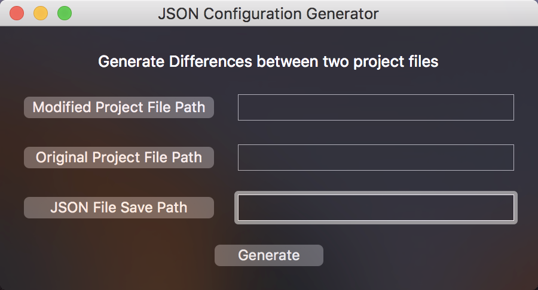

# pbxprojHelper 

pbxprojHelper lets you create and modify Xcode projects from Native UI App developed with Cocoa and Swift 3. You can also  use `pbxproj` as a command line tool in terminal.


## Installing pbxprojHelper

### GitHub

You can clone the [source code](https://github.com/yulingtianxia/pbxprojHelper/) of pbxprojHelper, then compile and run it by Xcode.

You can also download pbxprojHelper.app and pbxproj tool with its latest [Releases](https://github.com/yulingtianxia/pbxprojHelper/releases) on GitHub.

### App Store

Mac App Store link: (Only pbxprojHelper.app)

https://itunes.apple.com/cn/app/pbxprojhelper/id1160801848

## Quickstart

### Use pbxprojHelper (Native Cocoa UI App)

1. Choose your project file by clicking "Select" button. Both `.xcodeproj` and `.pbxproj` file extensions are supported. The path of project file you selected will be displayed on the text field. The outline view shows data of project file.
2. Choose configuration file by clicking "Choose JSON File". Configuration file contains changes you want to make to your project. You can create a configuration file with json format, or generate it using "JSON Configuration Generator" tool provided by pbxprojHelper. The outline view will refresh data after you choose a json file.
3. Clicking "Apply" button will write changes made by json configuration to project file you selected.
4. "Revert" button lets you revert your project file to latest version.

### Use pbxproj (Command Line Tool)

You should move pbxproj to `/usr/local/bin/`, so you can execute `pbxproj` command conveniently in terminal.

Here is the Usage:

```
Usage: pbxproj [command_option] file
Command options are (-convert is the default):
-compare modified_file -o path          compare modified property list file with property list file and generate a json result at the given path
-apply json_file                        apply a json file on property list file
-revert                                 revert property list file to latest backup
-convert                                rewrite property list files in xml format
```

## Outline View

The outline view shows entire data of project.pbxproj file. You can expand an item if it's type is collection(dictionary or array). For example, the value for key `objects` is an dictionary which contains 34 key-value pairs. You can expand `objects` to view its content. For key-value pairs of dictionary, the 1st/2nd column means "Key"/"Value". If the value is a collection(not String or Number.ect), the 2nd column shows a description of the collection; For elements of array, the 1st column means "Element", but the 2nd column contains nothing.

**You can paste the text in outline view by just a click on the text. If you want to paste the whole keypath from root node, double click it.**

## Filter

You can filt the content of outline view by typing a string in the "Filter" Text Field. It's not case sensitive.

## JSON Configuration File

### Configuration Rules

The configuration file contains a list of rules. Here is an example of configuration: 

```
{
  "insert" : {
    "objects.A45A665D1D98286400DBED04.children" : [
      "a",
      "b",
      "c"
    ],
    "classes" : {
      "xixihaha": 5,
      "aaaaa" : "养小鱼"
    }
  },
  "remove" : {
    "objects.A45A666D1D98286400DBED04.buildSettings" : [
      "ALWAYS_SEARCH_USER_PATHS"
    ]
  },
  "modify" : {
    "archiveVersion" : "2"
  }
}
```

The root object is a dictionary with 3 key-value pairs. You can "insert", "remove" and "modify" values through their key paths in project.pbxproj file. All array datas are leaf nodes in project.pbxproj file, so I recommend that you should **modify the whole array** instead of *remove* elements. 

#### Insert

The example above inserts 3 elements(`"a"`,`"b"`,`"c"`) into the `children` array. Note that the keypath `"objects.A45A665D1D98286400DBED04.children"` must be valid. The value of `"children"` should be an array and the value of `"classes"` should be a dictionary. **In a word, the type of incremental data should be same with original data in project.pbxproj file.**

#### Remove

The example above removes a key-value pair whose key equals `"ALWAYS_SEARCH_USER_PATHS"` from a dictionary named `buildSettings`. **The value of keypath should always be an array.** This array contains keys/elements you want to removed from dictionary/array.

#### Modify

Modify the value of keypath, so easy.

### Configuration Generator

Programmer is lazy. I can't stand wasting my time on writing json files, so I create the powerful tool called "JSON Configuration Generator":



**There are two ways to open the "Generator" window:**

1. Menu -> Window -> JSON Configuration Generator
2. Key Equivament: ⇧⌘0

You can use it in an oversimplified and crude way. Just select two project files and json save path, then click the "Generate" button, and you will get a json file containing changes between modified and original project file.

Conversely, you can use this json file when you want to apply these changes to certain project file again.

## Backups

Each time you click "Apply" button on main window, pbxprojHelper will use original or last modified project file to create backup file with "backup" extension in "Documents" folder of sandbox first, and then apply changes on project file.

"Revert" button uses these backups to revert project file to the latest version.

## Encoding

When generating project.pbxproj file with xml format, chinese characters will be translated to Unicode mathematical symbols. For example, `"杨萧玉"` in OpenStep style file will be translated to `<string>&#26472;&#33831;&#29577;</string>` in XML style. This is because Xcode will encode XML content(regarded as ASCII encoding) into Unicode again when convert XML project file to OpenStep project file.

## LICENSE

These works are available under the GNU General Public License. See the [LICENSE](https://github.com/yulingtianxia/pbxprojHelper/blob/master/LICENSE) file for more info.